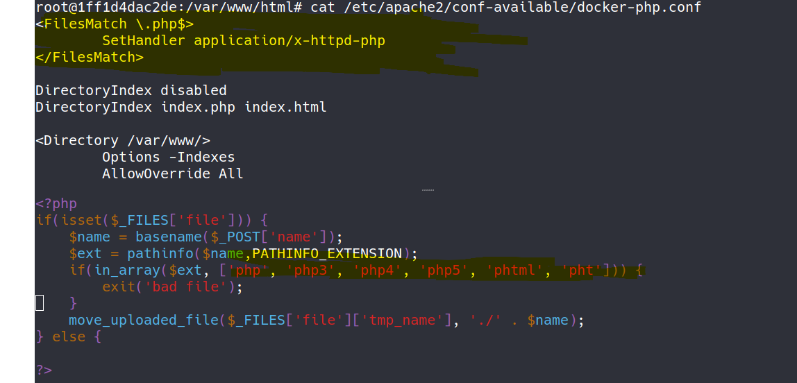
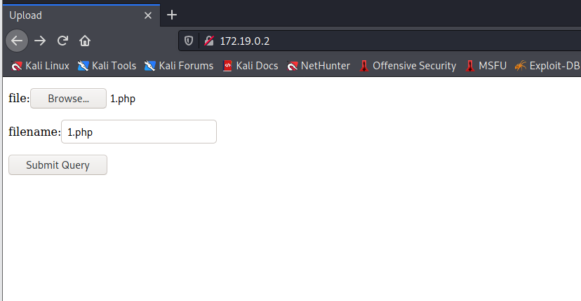
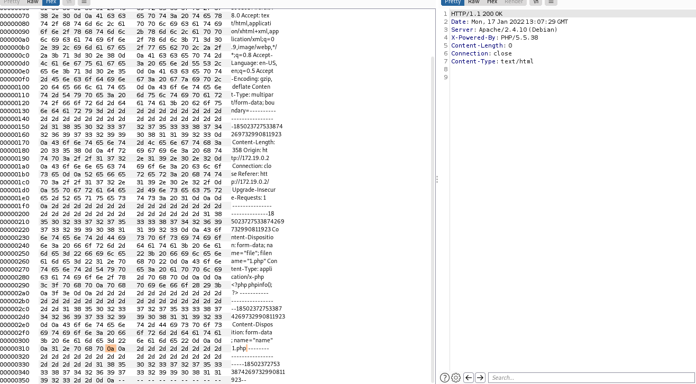
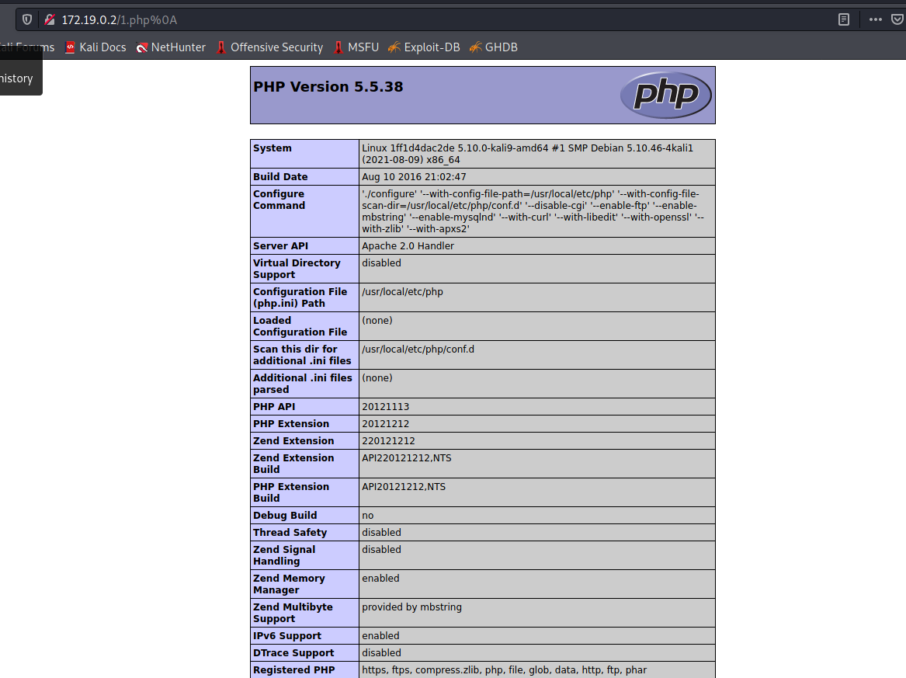

# Apache HTTPD 换行解析漏洞（CVE-2017-15715）

[Vulhub - Docker-Compose file for vulnerability environment](https://vulhub.org/#/environments/httpd/CVE-2017-15715/)

### 漏洞描述

由于开发人员在对PHP文件解析逻辑上设置通配符导致解析漏洞

### 漏洞影响版本

> **Apache HTTPD **2.4.0~2.4.29

### 漏洞利用原理

可以看到匹配规则为.php$，（$符号匹配到换行符为结尾）可以解析.php开头的文件为php，又因为前端只做了黑名单过滤，所以构造文件名为xxx.php%0a（换行），一方面绕过了黑名单，另一方面利用通配符解析漏洞，将其解析为php文件。

### 漏洞利用过程

我们写好一个php文件并上传

~~~php
<?php
    phpinfo();
?>
~~~

将php后的hex改为0a，send即可，再次访问构造好的文件1.php%0a即可得到相关php环境配置信息。

